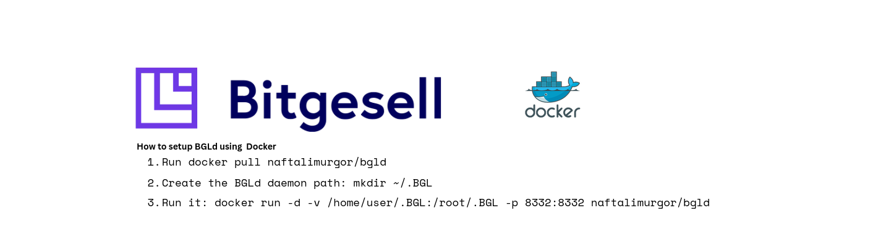

BGLd for Docker
===================
<a href="https://hub.docker.com/r/naftalimurgor/bgld">
	
</a>
Docker image that runs the Bitgesell bgld node in a container for easy deployment.


Requirements
------------

* Physical machine, cloud instance, or VPS that supports Docker i.e. Vultr, Digital Ocean, KVM or XEN based VMs) running Ubuntu 18.04 or later

* At least 10 GB to store the block chain files (and always growing!)
* At least 500 MB + 1 GB swap file

Really Fast Quick Start
-----------------------

One liner for Ubuntu 20.04 LTS machines with JSON-RPC enabled on localhost and adds upstart init script:

    curl https://raw.githubusercontent.com/naftalimurgor/bgld-docker/master/bootstrap-host.sh | sh

Quick Start
-----------

1. Run an instance of Bitegesell node as follows:

```sh
       cd ~
       mkdir .BGL
       docker run -d -v /home/user/.BGL:/root/.BGL -p 8332:8332 naftalimurgor/bgld
```

> NB: remember to mount volume to keep block persistent during Container restarts

2. Verify that the container is running and bgld node is downloading the blockchain

        $ docker ps
        CONTAINER ID   IMAGE                COMMAND   CREATED         STATUS         PORTS                                                 NAMES
        304e5a74a539   naftalimurgor/bgld   "BGLd"    5 seconds ago   Up 3 seconds   0.0.0.0:8332->8454/tcp, :::8332->8332/tcp, 8332/tcp   naughty_greider

3. You can then access the daemon's output thanks to the [docker logs command]( https://docs.docker.com/reference/commandline/cli/#logs)

        docker logs -f bgld

4. Install optional init scripts for upstart and systemd are in the `init` directory.


Documentation
-------------

* Additional documentation in the [docs folder](https://github.com/naftalimurgor/bgld-docker/tree/main/docs).
